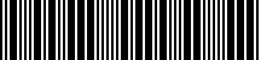
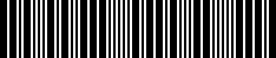
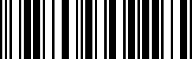
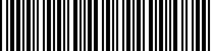
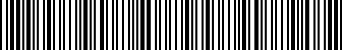
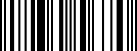
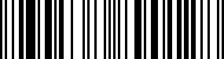

# Altairis.Barcode
Barcode generation library

# Supported barcodes 

## Code 25 (Code 2/5, Code 2 of 5)

### Code 25 IATA

### Code 25 Industrial

### Code 25 Interleaved

## Code 39

### Code 39 Standard

### Code 39 Full ASCII

## EAN

## EAN-8

## EAN-13

